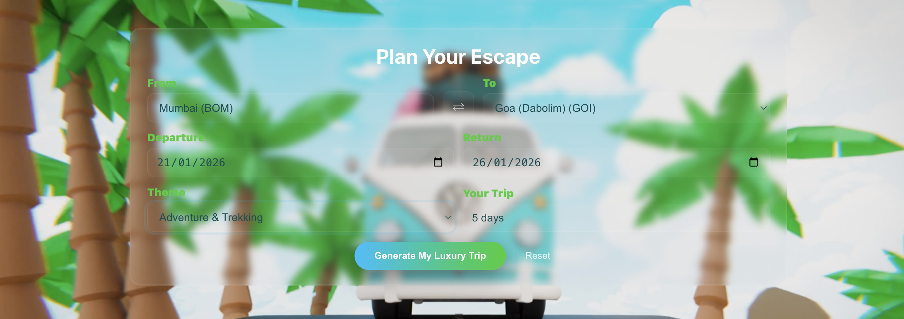
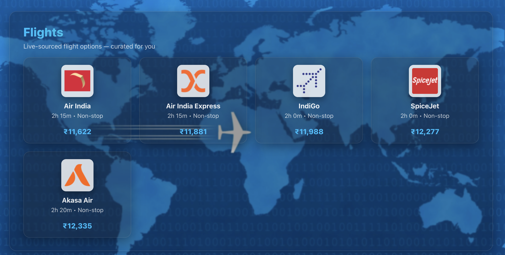
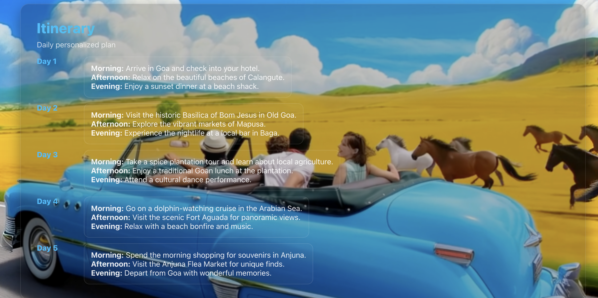
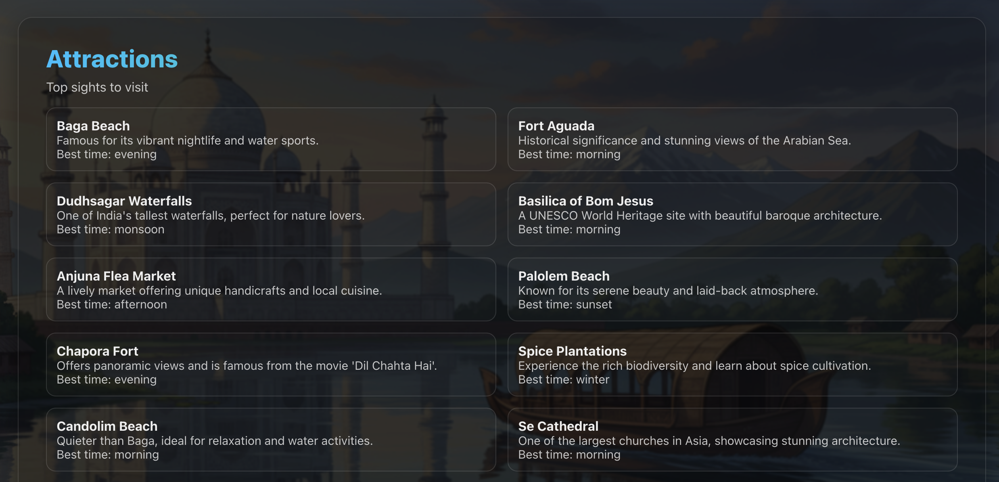
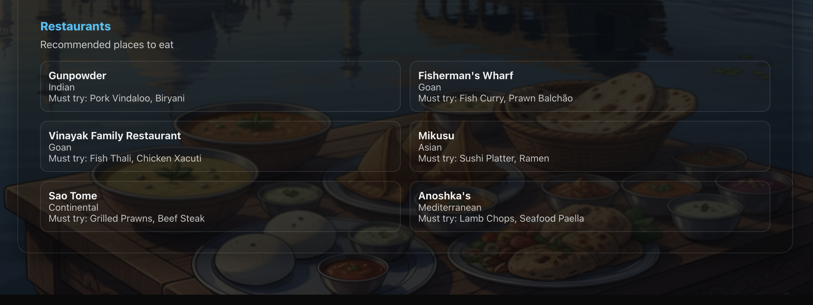
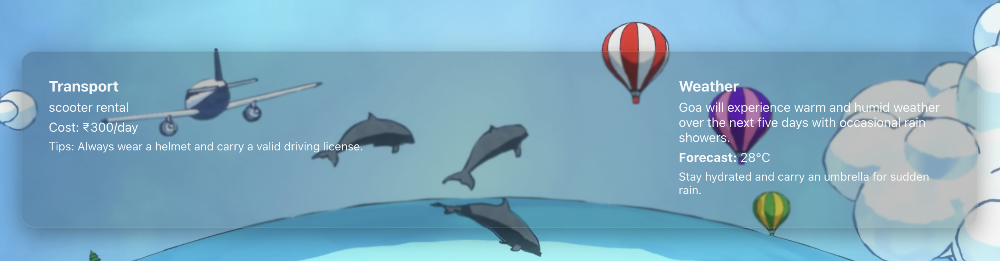

# ✨ Luxura – AI-Powered Indian Travel Planner
**Your Personalized AI Travel Companion**  
Built using **FastAPI**, **React**, and **Docker**

---


## 🚀 Overview

**Luxura** is an AI-powered travel planner that generates personalized trips across India.  
It combines real-time flights, AI-curated hotels, attractions, restaurants, daily itinerary planning, and weather insights — all in one modern, video-based interface.


## 🛠 Tech Stack

### Frontend
- React.js  
- Video-based UI  
- CSS Glassmorphism  


### Backend
- FastAPI  
- Python  
- Uvicorn  
- SerpAPI (Google Flights)  
- Weather + Transport Agents  
- Itinerary Generation  

### Tools
- Docker  
- Docker Compose  
- Node.js  

## 📸 Screenshots

### 🏠 Home Page


### ℹ️ Info Section


### 🧭 Input Form


### ✈️ Live Flights Section


### 🏨 Hotels


### 🗓 Itinerary Planner


### 🌆 Attractions


### 🍽 Restaurants


### 🚕 Weather & Transport



## 🐳 Run With Docker (Recommended)

### Start both frontend & backend:
bash
docker compose up --build

### Access your app:
- **Frontend:** http://localhost:3000  
- **Backend:** http://localhost:8000  

### Stop containers:
bash
docker compose down

### Rebuild after changes:
bash
docker compose up --build

## 🗂 Project Structure

```
luxura/
├── backend/
│   ├── main.py
│   ├── serpapi_helper.py
│   ├── flights_agent.py
│   ├── hotels_agent.py
│   ├── itinerary_agent.py
│   ├── weather_agent.py
│   └── requirements.txt
│
├── frontend/
│   ├── public/
│   │   ├── luxura_home.png
│   │   ├── luxura_info.png
│   │   ├── luxura_input_form.png
│   │   ├── luxura_flights.png
│   │   ├── luxura_hotels.png
│   │   ├── luxura_itinerary.png
│   │   ├── luxura_attractions.png
│   │   ├── luxura_restaurants.png
│   │   └── luxura_transportandweather.png
│   │
│   ├── src/
│   │   ├── components/
│   │   ├── pages/
│   │   ├── styles/
│   │   └── api.js
│   │
│   └── package.json
│
├── docker-compose.yml
├── Dockerfile.backend
├── Dockerfile.frontend
└── README.md

```

## 🤖 Features

- Live flight data from SerpAPI  
- Luxury / mid-range / budget hotel suggestions  
- Daily itinerary generator  
- Attractions & restaurant lists  
- Weather + transport recommendations  
- Video-based animated UI  
- Glassmorphism modern design  
- Fully Dockerized  
- Mobile responsive  


## 🎓 Why This Project Is Great for Interviews

- Strong full-stack architecture  
- API integration (real data)  
- AI-driven travel agents  
- Modern UI design  
- Docker-based environment  
- Easy to run anywhere  
- Great visual appeal  


## 🧑‍💻 Author

**Manav Mangela**  
AI & Full-Stack Developer  

⭐ *If you like this project, consider giving the repository a star!*  
